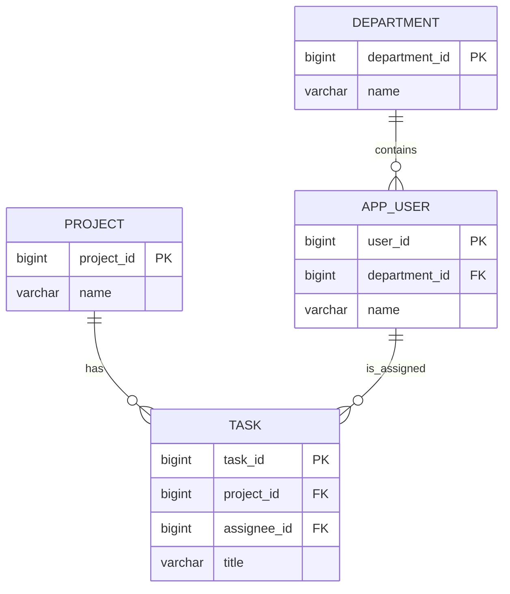
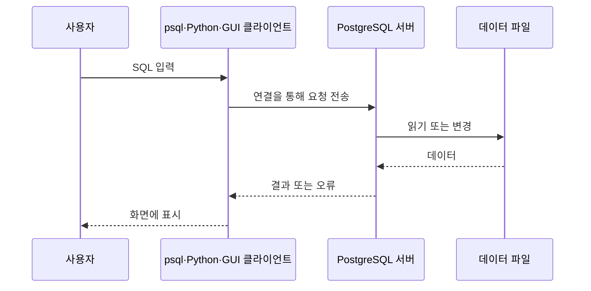

# 1장 PostgreSQL 이해하기

데이터베이스를 처음 배우면 테이블, 서버, 스키마처럼 비슷해 보이는 말이 한꺼번에 등장합니다. 이 장에서는 설치보다 먼저 각 개념이 맡은 역할과 PostgreSQL 프로그램의 전체 구조를 잡습니다. 이 지도를 알고 나면 뒤에서 입력하는 명령이 무엇을 바꾸는지 판단하기 쉬워집니다.

## 이 장에서 배울 내용

- 데이터베이스(database)와 데이터베이스 관리 시스템(DBMS)을 구분한다.
- 관계형 데이터베이스가 데이터를 행, 열과 관계로 표현하는 방식을 설명한다.
- PostgreSQL의 특징과 다른 대표 DBMS와의 차이를 큰 범위에서 이해한다.
- PostgreSQL 서버, 데이터베이스, 스키마와 테이블의 포함 관계를 설명한다.
- 클라이언트가 서버에 요청하고 결과를 받는 흐름을 이해한다.

## 선행 지식

필요한 선행 지식은 없습니다. Windows에서 파일과 폴더를 사용해 본 경험이면 충분합니다. 이 장에서는 PostgreSQL을 아직 설치하지 않습니다.

## 1. 데이터는 왜 관리해야 할까

업무 관리 시스템에서 다음과 같은 정보를 기록한다고 생각해 봅시다.

- 사용자와 부서
- 프로젝트와 업무
- 업무 담당자, 상태, 우선순위와 마감일
- 댓글과 변경 이력

메모장 파일에도 내용을 적을 수 있지만 데이터가 늘어나면 문제가 생깁니다. 같은 사람의 이름을 여러 파일에 반복해서 적고, 한 곳만 수정하거나, 동시에 저장하다가 다른 사람의 변경을 덮어쓸 수 있습니다. "이번 달에 완료된 업무가 가장 많은 부서" 같은 질문에 답하려면 여러 파일을 직접 모아 계산해야 합니다.

데이터베이스(database)는 서로 관련된 데이터를 일정한 구조로 모은 집합입니다. 데이터베이스 관리 시스템(Database Management System, DBMS)은 그 데이터를 저장하고 조회하며 여러 사용자의 동시 작업, 권한, 복구를 관리하는 소프트웨어입니다.

비유하면 데이터베이스는 잘 정리된 자료 묶음이고 DBMS는 자료를 보관하고 요청에 따라 찾아 주는 사서입니다. PostgreSQL은 DBMS 제품의 하나입니다. 일상적으로 "PostgreSQL 데이터베이스를 설치한다"고 말하지만, 정확히는 PostgreSQL DBMS를 설치하고 그 안에 데이터베이스를 만듭니다.

## 2. 관계형 데이터베이스

관계형 데이터베이스(relational database)는 데이터를 관계(relation), 즉 표와 비슷한 구조로 표현합니다. 실무와 이 책에서는 관계를 주로 **테이블(table)**이라고 부릅니다.

| task_id | title | status | due_date |
|---:|---|---|---|
| 1 | 요구사항 정리 | done | 2026-08-05 |
| 2 | 화면 설계 | in_progress | 2026-08-08 |

테이블의 가로 한 줄은 행(row)이며 하나의 대상을 나타냅니다. 세로 항목은 열(column)이며 대상의 속성을 나타냅니다. 위 표에서 두 번째 행은 하나의 업무이고 `title`과 `status`는 업무의 속성입니다.

### 2.1 키로 행을 구분한다

이름이나 제목은 겹칠 수 있습니다. 따라서 각 행을 확실히 구분하는 **기본 키(primary key)**를 둡니다. 위의 `task_id`가 기본 키입니다. 서로 다른 행은 같은 `task_id`를 가질 수 없습니다.

다른 테이블의 행을 가리키는 열은 **외래 키(foreign key)**입니다. 예를 들어 업무 테이블의 `project_id`가 프로젝트 테이블의 기본 키를 가리키면 "이 업무가 어느 프로젝트에 속하는가"라는 관계가 생깁니다.



이 모델은 책 전체에서 확장할 업무 관리 시스템의 일부를 미리 단순화한 것입니다. 테이블 설계와 정확한 관계는 6장에서 다룹니다.

### 2.2 구조와 규칙을 함께 저장한다

관계형 DBMS는 값만 저장하지 않습니다. 각 열에 허용할 데이터 타입(data type), 값이 반드시 필요한지, 값의 중복을 허용할지 같은 규칙도 관리합니다. 예를 들어 마감일 열에는 날짜를 저장하고, 업무 상태에는 정해진 값만 허용할 수 있습니다. 잘못된 데이터를 입력 단계에서 막는 장치가 됩니다.

### 2.3 SQL로 질문한다

SQL(Structured Query Language)은 관계형 데이터베이스에 요청을 표현하는 언어입니다. 다음 문장은 `task` 테이블에서 완료된 업무의 제목을 요청한다는 뜻입니다. 지금은 실행하지 않고 모양만 살펴봅니다.

```sql
SELECT title
FROM task
WHERE status = 'done';
```

SQL은 조회뿐 아니라 데이터 입력·수정·삭제, 테이블 정의와 권한 관리에도 사용합니다.

## 3. PostgreSQL의 특징

PostgreSQL은 오픈 소스 객체 관계형 데이터베이스 관리 시스템(Object-Relational Database Management System, ORDBMS)입니다. 관계형 모델과 SQL을 중심으로 하면서 사용자 정의 타입, 함수, 연산자 같은 확장 기능도 제공합니다.

주요 특징은 다음과 같습니다.

- 트랜잭션(transaction)을 통해 여러 변경을 하나의 작업 단위로 처리합니다.
- MVCC(Multi-Version Concurrency Control)로 여러 사용자의 읽기와 쓰기를 조정합니다.
- 기본 키, 외래 키, `CHECK` 등 데이터 무결성 규칙을 지원합니다.
- 표준 SQL 기능과 CTE, 윈도 함수, `RETURNING` 같은 실용적인 문법을 제공합니다.
- JSONB, 배열, 전문 검색과 다양한 인덱스 방식을 제공합니다.
- 함수, 확장(extension), 사용자 정의 타입으로 기능을 확장할 수 있습니다.
- Linux, Windows와 macOS 등 여러 운영체제에서 사용할 수 있습니다.

기능이 많다고 모든 기능을 처음부터 써야 하는 것은 아닙니다. 이 책은 일반적인 테이블과 SQL에서 시작해 필요한 기능을 한 단계씩 추가합니다.

## 4. 다른 DBMS와 무엇이 다른가

대표적인 관계형 DBMS는 공통으로 SQL과 트랜잭션을 지원하지만 설치 방식, 라이선스, 확장 기능과 세부 문법이 다릅니다.

| 제품 | 간단한 특징 | 처음 선택할 때 살펴볼 점 |
|---|---|---|
| PostgreSQL | 오픈 소스, 풍부한 SQL과 확장 기능 | 표준적인 서버형 DB와 다양한 데이터 처리가 필요할 때 |
| MySQL | 널리 사용되는 오픈 소스 계열 DBMS | 기존 MySQL 생태계와 호환성이 중요할 때 |
| SQLite | 서버 없이 파일 하나로 동작 | 작은 로컬 프로그램이나 내장 저장소가 필요할 때 |
| SQL Server | Microsoft 생태계와 긴밀한 상용 DBMS | 조직의 Microsoft 도구와 운영 체계를 따를 때 |
| Oracle Database | 대규모 엔터프라이즈 기능을 제공하는 상용 DBMS | 기존 Oracle 시스템, 지원 계약과 전문 기능이 필요할 때 |

이 표는 제품의 우열이 아니라 선택 기준을 단순화한 것입니다. 같은 `SELECT`라도 문자열 결합, 자동 번호, 날짜 처리와 관리 명령은 제품마다 다를 수 있습니다. 이 책의 SQL과 운영 명령은 PostgreSQL을 기준으로 합니다.

## 5. PostgreSQL 객체의 포함 관계

처음에 가장 헷갈리는 구조를 큰 것부터 나열하면 다음과 같습니다.

```text
PostgreSQL 서버 인스턴스
├── 역할(role): 서버 전체에서 공유
├── 데이터베이스 postgres
└── 데이터베이스 task_management
    ├── 스키마 public
    │   ├── 테이블 project
    │   └── 테이블 task
    └── 스키마 audit
        └── 테이블 task_history
```

### 5.1 서버 인스턴스와 클러스터

PostgreSQL 서버(server)는 요청을 받아 데이터를 처리하는 실행 중인 프로그램입니다. PostgreSQL 문서에서 데이터베이스 클러스터(database cluster)는 하나의 서버가 관리하는 데이터베이스들의 모음과 그 저장 영역을 뜻합니다. 여러 컴퓨터를 묶는 일반적인 의미의 클러스터와 다르므로 주의합니다.

Ubuntu의 PostgreSQL 패키지는 `postgresql-common` 도구로 여러 버전과 클러스터를 관리합니다. 이 내용은 3장에서 실제 경로와 함께 확인합니다.

### 5.2 데이터베이스

데이터베이스(database)는 연결의 단위입니다. 클라이언트는 서버의 특정 데이터베이스에 접속합니다. 한 번 접속한 세션에서 다른 데이터베이스의 테이블을 `database.schema.table`처럼 바로 조회할 수는 없습니다. 다른 데이터베이스를 쓰려면 다시 연결하는 것이 기본입니다.

### 5.3 스키마

스키마(schema)는 한 데이터베이스 안에서 테이블과 같은 객체를 분류하는 이름 공간(namespace)입니다. 파일 시스템의 폴더와 비슷하지만 완전히 같지는 않습니다. 기본적으로 많이 사용하는 스키마 이름은 `public`입니다.

서로 다른 스키마에는 같은 이름의 테이블을 둘 수 있습니다. `public.task`와 `archive.task`는 다른 테이블입니다.

### 5.4 테이블과 다른 객체

테이블은 행과 열로 데이터를 저장합니다. PostgreSQL 데이터베이스에는 테이블 외에도 뷰(view), 인덱스(index), 시퀀스(sequence), 함수(function) 같은 객체가 있습니다. 각 객체는 뒤의 장에서 필요한 시점에 배웁니다.

### 5.5 역할

역할(role)은 로그인과 권한을 표현합니다. 역할은 특정 데이터베이스 안이 아니라 PostgreSQL 클러스터 전체에서 공유됩니다. PostgreSQL에서 "사용자"는 보통 로그인할 수 있는 역할을 편리하게 부르는 말입니다. Windows 사용자, Ubuntu 사용자와 PostgreSQL 역할은 서로 다른 계정 체계입니다.

## 6. 클라이언트·서버 구조

PostgreSQL은 클라이언트(client)와 서버(server)가 나뉘어 동작합니다.



`psql`은 PostgreSQL에 포함된 명령줄 클라이언트입니다. 서버 그 자체가 아닙니다. pgAdmin, DBeaver와 Python 프로그램도 같은 서버에 접속할 수 있는 다른 종류의 클라이언트입니다.

클라이언트와 서버가 같은 Ubuntu 안에서 실행될 수도 있고, Windows의 GUI 프로그램이 WSL 안의 서버에 네트워크로 접속할 수도 있습니다. 어느 경우든 다음 접속 정보가 필요합니다.

- 서버 주소(host)
- 포트(port, 기본값 `5432`)
- 데이터베이스 이름
- PostgreSQL 역할 이름
- 인증 방식에 따라 비밀번호 등의 인증 정보

서버 프로세스가 실행 중이어야 요청을 받을 수 있고, 서버의 인증 규칙과 역할 권한을 통과해야 합니다.

## 7. 원리 이해: SQL 한 문장이 처리되는 흐름

클라이언트가 SQL을 보내면 서버는 대략 다음 과정을 거칩니다.

1. 문법을 분석해 올바른 SQL인지 확인합니다.
2. 테이블과 열이 존재하는지, 역할에 권한이 있는지 확인합니다.
3. 여러 실행 방법 중 비용이 낮을 것으로 예상되는 계획을 선택합니다.
4. 계획에 따라 데이터를 읽거나 변경합니다.
5. 결과 또는 오류 정보를 클라이언트로 돌려보냅니다.

그래서 오류도 단계에 따라 다릅니다. 문법이 틀렸을 수도 있고, 테이블이 없거나 권한이 부족할 수도 있으며, 서버에 연결조차 되지 않을 수도 있습니다. 오류 문구와 발생 단계를 구분하면 문제 해결이 쉬워집니다.

## 8. 따라 하기: 설치 전 구조 그려 보기

아직 명령을 실행하지 않습니다. 종이나 메모에 다음 질문의 답을 포함 관계로 그려 봅니다.

1. PostgreSQL 서버 하나에 `postgres`와 `task_management` 데이터베이스가 있습니다.
2. `task_management` 안에 `public`과 `audit` 스키마가 있습니다.
3. `public`에는 `project`, `task` 테이블이 있습니다.
4. `audit`에는 `task_history` 테이블이 있습니다.
5. `app_user` 역할은 `task_management`에 접속합니다.

앞의 트리와 비교해 다음을 확인합니다.

- 역할은 특정 스키마 안에 넣지 않습니다.
- 스키마는 데이터베이스 안에 있습니다.
- 테이블은 스키마 안에 있습니다.
- 클라이언트는 데이터베이스를 지정해 서버에 접속합니다.

## 9. 주의 및 오류 해결

### PostgreSQL과 SQL을 같은 것으로 생각한 경우

SQL은 요청을 표현하는 언어이고 PostgreSQL은 그 요청을 처리하는 DBMS입니다. 다른 DBMS도 SQL을 쓰지만 세부 기능과 문법은 다를 수 있습니다.

### 데이터베이스와 스키마를 같은 것으로 생각한 경우

PostgreSQL에서 클라이언트는 데이터베이스에 연결합니다. 스키마는 연결한 데이터베이스 내부의 객체를 구분합니다. `task_management.public.task`에서 각각 데이터베이스, 스키마, 테이블에 해당합니다.

### `psql`을 서버라고 생각한 경우

`psql`은 클라이언트입니다. `psql` 프로그램이 설치되어 있어도 서버가 설치 또는 실행되어 있지 않으면 로컬 서버에 접속할 수 없습니다.

### PostgreSQL 역할과 Ubuntu 사용자를 혼동한 경우

두 계정은 별도입니다. 같은 이름을 사용할 수 있지만 자동으로 같은 계정이 되는 것은 아닙니다. 인증 설정에 따라 운영체제 사용자 이름을 PostgreSQL 역할과 대조할 수 있을 뿐입니다.

## 10. 실습 문제

### 기본 문제

1. 데이터베이스와 DBMS의 차이를 업무 관리 시스템 예로 설명해 보세요.
2. `task_id`, `title`, `due_date`가 있는 표에서 행과 열이 각각 무엇을 뜻하는지 설명해 보세요.
3. 기본 키가 필요한 이유를 한 문장으로 적어 보세요.
4. 서버, 데이터베이스, 스키마와 테이블을 큰 범위부터 나열해 보세요.

### 응용 문제

1. 부서와 사용자의 일대다 관계에서 외래 키를 어느 테이블에 둘지 생각해 보세요.
2. `public.task`와 `archive.task`라는 이름을 함께 사용할 수 있는 이유를 설명해 보세요.
3. Windows의 DBeaver가 WSL의 PostgreSQL에 접속할 때 클라이언트와 서버가 각각 어디에 있는지 그려 보세요.

## 실습 문제 정답

### 기본 문제 정답

1. 데이터베이스는 부서·사용자·프로젝트·업무 데이터의 집합이고, DBMS인 PostgreSQL은 그 데이터를 저장·조회·보호하는 소프트웨어입니다.
2. 행은 업무 한 건이며 열은 모든 업무에 같은 의미로 적용되는 `task_id`, `title`, `due_date` 같은 속성입니다.
3. 기본 키는 각 행을 중복 없이 식별해 정확한 조회와 다른 테이블의 참조를 가능하게 합니다.
4. 큰 범위부터 `서버(클러스터) → 데이터베이스 → 스키마 → 테이블`입니다.

### 응용 문제 정답

1. 부서 하나에 사용자가 여러 명이므로 외래 키 `department_id`는 다(N) 쪽인 사용자 테이블에 둡니다.
2. 스키마가 이름 공간을 나누므로 완전한 이름 `public.task`와 `archive.task`가 서로 다릅니다.
3. DBeaver는 Windows에서 실행되는 클라이언트이고 PostgreSQL 서버는 WSL 2의 Ubuntu에서 실행됩니다. 클라이언트가 서버 주소와 포트로 SQL을 보내고 결과를 받습니다.

## 11. 핵심 정리

- 데이터베이스는 관련 데이터의 집합이고 DBMS는 이를 관리하는 소프트웨어입니다.
- PostgreSQL은 오픈 소스 객체 관계형 DBMS입니다.
- 관계형 데이터베이스는 데이터를 테이블의 행과 열로 표현합니다.
- 기본 키는 행을 식별하고 외래 키는 테이블 사이의 관계를 표현합니다.
- SQL은 데이터베이스에 조회와 변경을 요청하는 언어입니다.
- PostgreSQL 서버는 여러 데이터베이스를 관리합니다.
- 스키마는 한 데이터베이스 안의 이름 공간이고 테이블은 스키마에 속합니다.
- 역할은 클러스터 전체에서 공유되며 운영체제 사용자와 별개입니다.
- `psql`, GUI 도구와 Python 프로그램은 PostgreSQL 클라이언트가 될 수 있습니다.

## 12. 확인 문제

1. 다음 중 DBMS는 무엇입니까? ① SQL ② PostgreSQL ③ `SELECT` ④ JSON
2. 테이블에서 하나의 대상을 나타내는 가로 한 줄을 무엇이라고 합니까?
3. 한 데이터베이스 안에서 객체 이름을 분류하는 이름 공간은 무엇입니까?
4. PostgreSQL의 기본 포트 번호는 무엇입니까?
5. 참 또는 거짓: `psql`이 실행되면 PostgreSQL 서버도 반드시 실행 중이다.

정답: 1. ②, 2. 행(row), 3. 스키마(schema), 4. `5432`, 5. 거짓

## 다음 장 안내

이 장에서 PostgreSQL이 서버형 DBMS이고 클라이언트가 연결해 SQL을 보낸다는 구조를 익혔습니다. 다음 장에서는 이 서버를 실행할 기반인 WSL 2와 Ubuntu 26.04를 Windows 11에 준비하고, Bash와 Linux 파일 시스템의 기본 사용법을 연습합니다.
