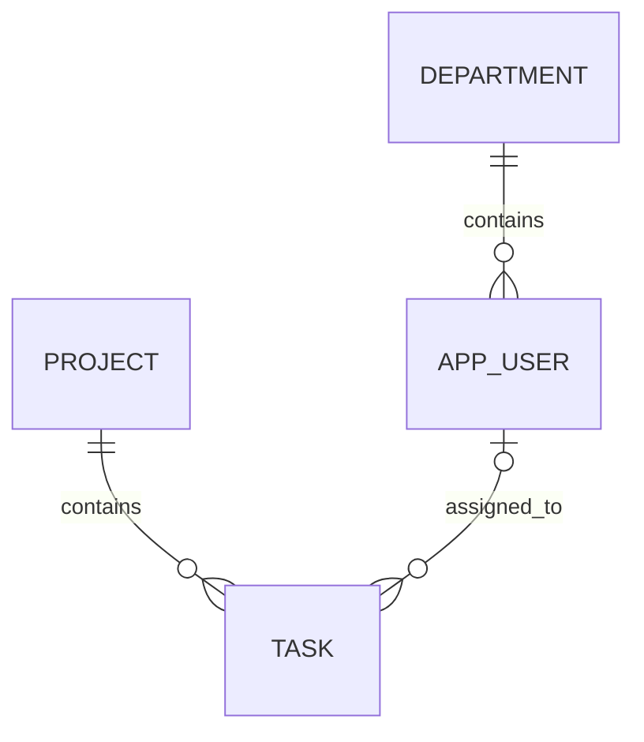
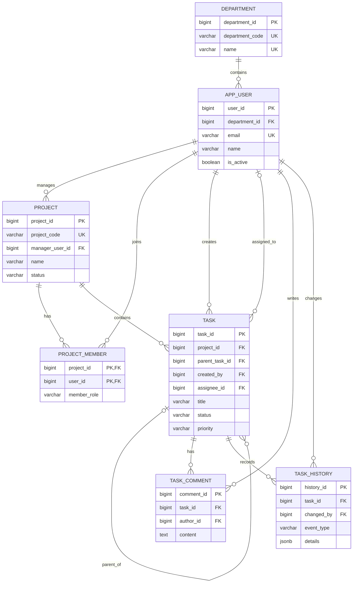

# 6장 테이블 설계의 기초

테이블을 만드는 SQL 문법부터 시작하면 열을 빠르게 추가할 수는 있지만, 왜 그 열이 필요한지와 테이블 사이의 관계가 올바른지는 보장할 수 없습니다. 좋은 설계는 먼저 현실의 대상을 구분하고 업무 규칙을 문장으로 정리한 뒤, 키와 관계, NULL 허용 여부를 결정하는 과정에서 나옵니다. 이 장에서는 업무 관리 시스템의 요구사항을 분석해 교재 전체에서 사용할 데이터 모델과 ERD를 확정합니다.

> **설계 기준**  
> 이 장의 기준 모델은 [업무 관리 시스템 요구사항과 데이터 모델](../references/task_management_model.md)에 기록합니다. 열의 정확한 PostgreSQL 데이터 타입은 7장, 실제 `CREATE TABLE`과 제약조건은 8장에서 구현합니다. 이 장에서는 설계와 SQL 문법을 섞어 성급하게 확정하지 않습니다.

## 이 장에서 배울 내용

- 테이블, 행과 열을 현실의 엔터티와 속성에 대응시킨다.
- 기본 키, 외래 키, 자연 키와 대리 키의 역할을 구분한다.
- NULL을 빈 문자열이나 0과 구분하고 선택 속성을 결정한다.
- 일대일, 일대다, 다대다와 자기 참조 관계를 읽는다.
- 정규화가 중복과 변경 이상을 줄이는 이유를 설명한다.
- 업무 관리 시스템의 요구사항을 ERD와 테이블 목록으로 변환한다.

## 선행 지식

- 1장에서 관계형 데이터베이스와 서버·데이터베이스·스키마·테이블의 관계를 익혔습니다.
- 5장에서 `task_admin`, `task_app`과 `task_management` 데이터베이스를 준비했습니다.
- 기본 키와 외래 키라는 용어를 1장에서 간단히 보았습니다.

5장의 환경을 만들었다면 접속만 확인합니다.

**Ubuntu Bash**

```bash
psql -X -h localhost -p 5432 -U task_admin -d task_management -W
```

```sql
SELECT current_database(), current_user;
```

예상 핵심값은 `task_management`와 `task_admin`입니다. 이 장에서는 아직 영구 테이블을 만들지 않으므로 확인 후 종료합니다.

```text
\q
```

종이, Markdown 문서나 다이어그램만으로도 모든 설계 실습을 수행할 수 있습니다.

## 1. 요구사항에서 시작하기

**요구사항(requirement)**은 시스템이 저장하거나 수행해야 할 일을 설명하는 문장입니다. 다음처럼 구체적인 명사, 동사와 수량이 드러나야 데이터 모델로 옮길 수 있습니다.

```text
부서는 여러 사용자를 포함한다.
사용자는 정확히 한 부서에 소속된다.
사용자는 여러 프로젝트에 참여할 수 있다.
프로젝트에는 여러 사용자가 참여할 수 있다.
업무는 한 프로젝트에 속한다.
업무 담당자는 아직 정해지지 않을 수 있다.
```

"업무를 편리하게 관리한다"는 목표이지만 어떤 데이터를 저장할지 알 수 없어 설계 요구사항으로는 부족합니다. 다음 질문으로 구체화합니다.

- 무엇을 서로 구분해 저장해야 하는가?
- 각 대상에는 어떤 정보가 반드시 필요한가?
- 한 대상은 다른 대상 몇 개와 관계를 맺는가?
- 관계가 없어도 존재할 수 있는가?
- 값이 바뀌거나 대상이 삭제될 때 과거 기록을 어떻게 보존하는가?

### 1.1 업무 관리 시스템의 범위

이 책의 시스템은 소규모 조직에서 다음 작업을 지원합니다.

1. 부서와 사용자를 관리한다.
2. 프로젝트와 참여자를 관리한다.
3. 프로젝트 안에 업무와 하위 업무를 만든다.
4. 업무 작성자, 담당자, 상태, 우선순위와 일정을 기록한다.
5. 업무 댓글과 주요 변경 이력을 보존한다.

다음 기능은 초기 데이터 모델 범위에서 제외합니다.

- 급여, 인사 평가와 근태
- 파일 본문 저장과 버전 관리
- 채팅과 실시간 알림 전송
- 외부 고객과 결제
- 여러 회사가 한 데이터베이스를 공유하는 멀티테넌시

범위를 먼저 제한하면 모든 가능성을 한꺼번에 테이블에 넣는 일을 피할 수 있습니다.

## 2. 테이블, 행과 열

### 2.1 엔터티를 테이블 후보로 찾기

**엔터티(entity)**는 시스템에서 독립적으로 구분하고 정보를 저장할 대상입니다. 요구사항의 명사 가운데 식별하고 여러 속성을 기록해야 하는 대상을 찾습니다.

| 요구사항 명사 | 테이블 후보 | 판단 |
|---|---|---|
| 부서 | `department` | 코드, 이름과 여러 사용자를 가짐 |
| 사용자 | `app_user` | 이메일, 이름, 소속과 상태를 가짐 |
| 프로젝트 | `project` | 코드, 이름, 기간과 상태를 가짐 |
| 프로젝트 참여 | `project_member` | 사용자와 프로젝트 사이의 관계에도 역할·참여 시각이 있음 |
| 업무 | `task` | 제목, 상태, 담당자와 일정을 가짐 |
| 댓글 | `task_comment` | 작성자, 본문과 작성 시각을 가짐 |
| 변경 이력 | `task_history` | 변경자, 사건 종류, 상세와 시각을 가짐 |
| 우선순위 | 별도 테이블 아님 | 초기에는 소수의 고정 코드로 관리 |

모든 명사가 테이블이 되는 것은 아닙니다. 우선순위처럼 값의 종류가 적고 자체 속성이 없는 것은 `task`의 열과 제약조건으로 시작할 수 있습니다. 반대로 프로젝트 참여는 두 대상을 연결하는 관계지만 참여 역할과 시각을 저장해야 하므로 독립 테이블이 됩니다.

### 2.2 행은 한 개체, 열은 한 종류의 속성

`app_user` 테이블을 개념적으로 그려 봅니다.

| user_id | department_id | name | email | is_active |
|---:|---:|---|---|---|
| 1 | 10 | 김하늘 | haneul.kim@example.test | true |
| 2 | 20 | 이여름 | yeoreum.lee@example.test | true |

- 테이블(table): 같은 종류의 사용자 정보를 모은 구조
- 행(row): 사용자 한 명에 대한 기록
- 열(column): 모든 사용자에게 같은 의미로 적용되는 속성

한 셀에 여러 값을 쉼표로 넣지 않습니다.

```text
나쁜 예: project_members = '김하늘,이여름,박가람'
```

참여자를 검색하고 중복을 막거나 역할을 추가하기 어렵습니다. 프로젝트와 사용자의 다대다 관계는 `project_member`의 여러 행으로 표현합니다.

### 2.3 테이블 이름은 단수형으로 통일한다

이 책에서는 한 행이 나타내는 대상을 기준으로 단수형 `snake_case`를 사용합니다.

```text
department
app_user
project
project_member
task
task_comment
task_history
```

PostgreSQL 역할과 혼동될 수 있는 `user`, SQL 키워드와 충돌할 수 있는 이름, 큰따옴표가 필요한 이름을 피합니다.

## 3. 기본 키

**기본 키(primary key)**는 테이블에서 각 행을 유일하게 식별하는 열 또는 열의 조합입니다. 기본 키 값은 중복될 수 없고 NULL일 수 없습니다.

사용자 이름으로 행을 찾는다고 생각해 봅시다.

| name | email |
|---|---|
| 김하늘 | haneul.kim@example.test |
| 김하늘 | haneul2.kim@example.test |

동명이인이 있으면 이름만으로 어느 사용자인지 알 수 없습니다. 이메일은 현재는 고유해도 주소 변경 정책이 생길 수 있습니다. 따라서 관계에서 안정적으로 사용할 `user_id`를 기본 키로 둡니다.

```text
app_user 기본 키: user_id
project 기본 키: project_id
task 기본 키: task_id
```

PostgreSQL은 기본 키를 선언하면 해당 열을 `NOT NULL`로 만들고 고유 B-tree 인덱스를 자동 생성합니다. 실제 문법은 8장, 인덱스의 비용과 사용은 17장에서 다룹니다.

### 3.1 좋은 기본 키의 조건

- 모든 행에 값이 있다.
- 서로 다른 행에서 중복되지 않는다.
- 한 번 정하면 가능한 한 바뀌지 않는다.
- 관계에서 반복 사용하기에 지나치게 크거나 복잡하지 않다.
- 개인 정보나 업무 의미를 불필요하게 노출하지 않는다.

테이블 하나에는 기본 키가 하나만 있지만 여러 열을 묶은 복합 기본 키도 가능합니다.

## 4. 자연 키와 대리 키

### 4.1 자연 키

**자연 키(natural key)**는 업무 세계에서 이미 의미와 유일성이 있는 값입니다.

- `department.department_code`
- `app_user.email`
- `project.project_code`

자연 키는 사람이 기억하고 검색하기 쉽지만 정책 변경, 오타 수정과 형식 변경으로 값이 바뀔 수 있습니다. 이메일을 사용자 관계의 기본 키로 쓰면 이메일 변경 때 여러 외래 키에 영향을 줄 수 있습니다.

### 4.2 대리 키

**대리 키(surrogate key)**는 행을 식별하기 위해 시스템이 부여하는 업무 의미가 적은 키입니다.

- `department_id`
- `user_id`
- `project_id`
- `task_id`

이 책에서는 대부분의 주요 엔터티에 숫자 대리 키를 사용하고 자연 키에는 `UNIQUE` 제약을 둡니다.

```text
관계 연결: user_id
사람이 검색·입력: email
중복 방지: email UNIQUE
```

대리 키를 쓴다고 자연 키의 중복을 허용해서는 안 됩니다. 기본 키와 업무상 고유 규칙은 서로 다른 문제입니다.

### 4.3 복합 키가 더 자연스러운 관계

`project_member`는 "한 사용자가 한 프로젝트에 한 번만 참여한다"는 관계 자체를 나타냅니다.

| project_id | user_id | member_role |
|---:|---:|---|
| 100 | 1 | manager |
| 100 | 2 | member |
| 200 | 1 | viewer |

`project_id`와 `user_id`의 조합을 기본 키로 사용하면 같은 사용자를 같은 프로젝트에 두 번 넣는 일을 막습니다.

```text
project_member 기본 키: (project_id, user_id)
```

별도의 `project_member_id`를 추가할 수도 있지만 현재 요구사항에는 관계 행을 다른 곳에서 단독 참조할 필요가 없으므로 복합 키를 선택합니다.

## 5. 외래 키와 참조 무결성

**외래 키(foreign key)**는 한 테이블의 값이 다른 테이블의 유효한 행을 가리키도록 하는 규칙입니다. 이를 통해 **참조 무결성(referential integrity)**을 지킵니다.

```text
app_user.department_id → department.department_id
task.project_id        → project.project_id
task.assignee_id       → app_user.user_id
```

`task.project_id = 999`인데 `project_id = 999`인 프로젝트가 없다면 고아 업무가 됩니다. 외래 키는 이런 값을 거부합니다.

### 5.1 참조하는 쪽과 참조되는 쪽

```text
department                         app_user
-----------------                  ------------------
department_id 10  ◀──────────────  department_id 10
```

- 참조되는 테이블(parent): `department`
- 참조하는 테이블(child): `app_user`
- 참조되는 키: `department.department_id`
- 외래 키: `app_user.department_id`

외래 키는 기본 키나 `UNIQUE`로 행을 유일하게 찾을 수 있는 열을 참조해야 합니다.

### 5.2 삭제 정책은 업무 의미로 결정한다

부서를 삭제할 때 소속 사용자를 자동 삭제하면 인사 기록과 업무 이력까지 연쇄적으로 잃을 수 있습니다. 이 시스템은 다음 원칙을 사용합니다.

- 부서와 사용자는 참조가 있으면 삭제보다 비활성화를 우선한다.
- 프로젝트는 상태를 `cancelled`로 바꾸고 업무를 자동 삭제하지 않는다.
- 업무도 초기 범위에서는 물리 삭제보다 `cancelled` 상태를 사용한다.
- 댓글과 변경 이력은 감사 목적상 임의 연쇄 삭제하지 않는다.

`ON DELETE CASCADE`, `RESTRICT`, `SET NULL` 같은 실제 외래 키 동작은 8장에서 이 원칙과 대조해 선택합니다. "자식이 있으면 무조건 CASCADE" 같은 규칙은 없습니다.

## 6. NULL의 의미

**NULL**은 값이 0이거나 빈 문자열이라는 뜻이 아니라 **값이 없거나 알려지지 않았음**을 나타냅니다.

| 표현 | 의미 예 |
|---|---|
| `NULL` | 아직 담당자가 정해지지 않음 |
| `0` | 숫자 0이라는 실제 값 |
| `''` | 길이가 0인 문자열 값 |
| `'없음'` | 네 글자로 된 문자열 값 |

### 6.1 NULL을 허용할 열

업무 생성 시 아직 결정되지 않을 수 있는 값입니다.

- `task.assignee_id`: 담당자 미정
- `task.parent_task_id`: 최상위 업무
- `task.description`: 상세 설명 없음
- `task.start_date`: 시작일 미정
- `task.due_date`: 마감일 미정
- `task.completed_at`: 아직 완료되지 않음
- `project.end_date`: 종료일 미정
- `app_user.deactivated_at`: 활성 사용자

### 6.2 NULL을 허용하지 않을 열

행의 의미를 성립시키는 필수 값입니다.

- 모든 기본 키
- `app_user.department_id`
- `app_user.name`, `app_user.email`
- `project.project_code`, `project.manager_user_id`
- `task.project_id`, `task.created_by`, `task.title`
- 상태와 우선순위
- 생성 시각

### 6.3 NULL은 비교 방식도 다르다

NULL은 일반 값이 아니므로 `= NULL`로 검사하지 않고 `IS NULL`과 `IS NOT NULL`을 사용합니다. SQL 문법은 10장에서 연습합니다.

```sql
-- 개념 예시이며 테이블은 8장에서 만듭니다.
SELECT task_id, title
FROM task
WHERE assignee_id IS NULL;
```

`UNIQUE`와 NULL의 조합도 주의해야 합니다. PostgreSQL의 일반적인 `UNIQUE`에서는 기본적으로 여러 NULL을 서로 같은 값으로 보지 않습니다. 따라서 "NULL도 한 번만" 같은 규칙이 필요하면 별도 설계가 필요합니다.

### 6.4 필요할지 모르겠다는 이유로 NULL을 허용하지 않는다

모든 열을 선택으로 만들면 불완전한 행이 늘어납니다. 반대로 모든 열을 필수로 만들면 `'미정'`, `0`, 임의 날짜 같은 가짜 값을 넣게 됩니다. 각 열마다 다음 문장을 완성해 결정합니다.

```text
이 값이 없는 행도 업무상 유효한가?
값이 없다면 "미정", "해당 없음", "아직 발생하지 않음" 중 무엇인가?
```

## 7. 엔터티 관계와 카디널리티

**관계(relationship)**는 엔터티 사이의 연결이고, **카디널리티(cardinality)**는 한쪽 행 하나가 다른 쪽 행 몇 개와 연결될 수 있는지를 나타냅니다.

### 7.1 일대일 관계

**일대일(one-to-one, 1:1)**은 양쪽 행이 최대 하나씩 대응합니다. 예를 들어 사용자의 선택 프로필을 별도 테이블로 분리한다면 다음 관계가 될 수 있습니다.

```text
app_user 1 ─── 0..1 user_profile
```

하지만 현재 시스템에는 프로필만의 큰 속성 묶음이나 별도 보안 요구가 없으므로 `user_profile`을 만들지 않습니다. 일대일 테이블은 단지 열이 몇 개 많다는 이유만으로 분리하지 않습니다.

### 7.2 일대다 관계

**일대다(one-to-many, 1:N)**는 부모 한 행이 자식 여러 행과 연결되고 자식은 부모 하나를 가리킵니다.

```text
department 1 ─── N app_user
project    1 ─── N task
task       1 ─── N task_comment
```

외래 키는 보통 N 쪽에 둡니다. 따라서 `department_id`는 `app_user`, `project_id`는 `task`에 있습니다.

### 7.3 다대다 관계

**다대다(many-to-many, M:N)**는 양쪽 모두 여러 행과 연결될 수 있습니다.

```text
project M ─── N app_user
```

관계형 테이블 두 개만으로 직접 표현하지 않고 **연결 테이블(associative table)** `project_member`를 둡니다.

```text
project 1 ─── N project_member N ─── 1 app_user
```

연결 테이블에는 관계 자체의 속성인 `member_role`, `joined_at`도 저장합니다.

### 7.4 자기 참조 관계

업무는 같은 `task` 테이블의 다른 업무를 상위 업무로 가질 수 있습니다.

```text
task.task_id 1 ─── N task.parent_task_id
```

최상위 업무의 `parent_task_id`는 NULL이고 하위 업무만 유효한 상위 `task_id`를 가집니다. 같은 테이블을 참조해도 외래 키 원리는 같습니다.

### 7.5 선택성과 필수성

관계의 개수뿐 아니라 관계가 필수인지도 기록합니다.

| 관계 | 부모 쪽 | 자식 쪽 |
|---|---|---|
| 부서–사용자 | 부서는 사용자 0명 이상 | 사용자는 부서 정확히 1개 |
| 프로젝트–업무 | 프로젝트는 업무 0개 이상 | 업무는 프로젝트 정확히 1개 |
| 사용자–담당 업무 | 사용자는 담당 업무 0개 이상 | 업무 담당자는 0명 또는 1명 |
| 업무–댓글 | 업무는 댓글 0개 이상 | 댓글은 업무 정확히 1개 |

"0개 이상"은 부모 행이 자식 없이도 먼저 존재할 수 있다는 뜻입니다.

## 8. ERD 읽기

**ERD(Entity-Relationship Diagram)**는 엔터티, 속성과 관계를 그림으로 표현합니다. 이 책은 Crow's Foot 표기를 사용합니다.

| 기호 | 뜻 |
|---|---|
| `||` | 정확히 하나 |
| `o|` | 0 또는 하나 |
| `|{` | 하나 이상 |
| `o{` | 0개 이상 |

다음 관계를 읽어 봅니다.



- 부서 하나에는 사용자 0명 이상이 속하고 사용자는 부서 하나에 반드시 속합니다.
- 프로젝트 하나에는 업무 0개 이상이 속하고 업무는 프로젝트 하나에 반드시 속합니다.
- 사용자는 업무 여러 개를 담당할 수 있고 업무는 담당자가 없거나 한 명입니다.

ERD 선만 보지 말고 외래 키 열과 NULL 허용 여부를 함께 확인해야 모호함이 줄어듭니다.

## 9. 정규화가 필요한 이유

**정규화(normalization)**는 데이터 중복과 잘못된 의존 관계를 줄이도록 테이블을 구조화하는 과정입니다. 무조건 테이블 수를 늘리는 기술이 아니라 한 사실을 가능한 한 한 곳에 저장하려는 원칙입니다.

### 9.1 한 테이블에 모두 넣었을 때

다음과 같은 업무 목록을 생각해 봅니다.

| task_id | task_title | project_name | department_name | assignee_name | assignee_email |
|---:|---|---|---|---|---|
| 1 | 요구사항 정리 | 새 포털 | 개발팀 | 김하늘 | haneul.kim@example.test |
| 2 | 화면 설계 | 새 포털 | 개발팀 | 김하늘 | haneul.kim@example.test |
| 3 | 테스트 작성 | 새 포털 | 품질팀 | 이여름 | yeoreum.lee@example.test |

프로젝트 이름과 사용자 정보가 업무 수만큼 반복됩니다. 이 구조에는 다음 **이상(anomaly)**이 생깁니다.

- 수정 이상: 김하늘의 이메일을 모든 업무 행에서 바꿔야 한다.
- 삽입 이상: 업무가 없는 새 부서를 저장하기 어렵다.
- 삭제 이상: 마지막 업무를 지우면 프로젝트나 사용자 정보까지 사라질 수 있다.

### 9.2 제1정규형

**제1정규형(First Normal Form, 1NF)**에서는 한 열의 한 위치에 반복 목록이 아니라 한 값을 둡니다.

```text
나쁜 예: member_emails = 'a@example.test,b@example.test'
```

참여자 한 명당 `project_member` 한 행으로 바꿉니다.

### 9.3 제2정규형

**제2정규형(Second Normal Form, 2NF)**에서는 복합 키를 사용할 때 일반 속성이 키 전체에 의존해야 합니다.

`project_member`의 키가 (`project_id`, `user_id`)일 때 `project_name`은 `project_id`에만 의존하므로 이 테이블에 두지 않습니다. `project.name`에 한 번만 저장합니다.

### 9.4 제3정규형

**제3정규형(Third Normal Form, 3NF)**에서는 일반 속성이 다른 일반 속성을 거쳐 키에 의존하지 않도록 합니다.

`app_user`에 `department_id`와 `department_name`을 함께 두면 `department_name`은 사용자 키가 아니라 `department_id`에 의존합니다. 부서 이름은 `department`에 저장하고 사용자는 외래 키만 가집니다.

```text
app_user.user_id
  → app_user.department_id
      → department.name
```

### 9.5 정규화와 조회 성능

정규화한 데이터는 조회할 때 조인이 필요할 수 있습니다. 그렇다고 설계 초기에 중복 열부터 추가하지 않습니다. 먼저 정확한 모델을 만들고, 실제 실행 계획과 측정 결과가 있을 때 인덱스, 구체화된 뷰나 제한적인 비정규화를 검토합니다.

## 10. 업무 관리 시스템 데이터 모델 확정

### 10.1 최종 테이블 목록

| 테이블 | 한 행의 의미 | 기본 키 |
|---|---|---|
| `department` | 부서 한 개 | `department_id` |
| `app_user` | 업무 시스템 사용자 한 명 | `user_id` |
| `project` | 프로젝트 한 개 | `project_id` |
| `project_member` | 한 프로젝트에 참여한 사용자 한 명 | (`project_id`, `user_id`) |
| `task` | 업무 한 개 | `task_id` |
| `task_comment` | 업무 댓글 한 개 | `comment_id` |
| `task_history` | 업무 변경 사건 한 개 | `history_id` |

### 10.2 핵심 업무 코드

화면에는 한국어로 표시하더라도 데이터에는 안정적인 영문 코드를 사용합니다.

| 구분 | 값 |
|---|---|
| 프로젝트 상태 | `planned`, `active`, `on_hold`, `completed`, `cancelled` |
| 참여 역할 | `manager`, `member`, `viewer` |
| 업무 상태 | `todo`, `in_progress`, `blocked`, `done`, `cancelled` |
| 업무 우선순위 | `low`, `medium`, `high`, `urgent` |

열거형, 문자열과 참조 테이블 중 어떤 타입과 구조를 사용할지는 7장에서 비교합니다. 현재 단계에서는 허용할 업무 값만 확정합니다.

### 10.3 전체 ERD



`PK`는 기본 키, `FK`는 외래 키, `UK`는 고유 후보 키를 뜻합니다. Mermaid의 타입 표기는 아직 최종 SQL 선언이 아니라 설계 힌트입니다.

### 10.4 관계별 외래 키 배치

| 관계 | 외래 키 열 |
|---|---|
| 부서–사용자 | `app_user.department_id` |
| 사용자–관리 프로젝트 | `project.manager_user_id` |
| 프로젝트–참여자 | `project_member.project_id`, `project_member.user_id` |
| 프로젝트–업무 | `task.project_id` |
| 업무–상위 업무 | `task.parent_task_id` |
| 사용자–작성 업무 | `task.created_by` |
| 사용자–담당 업무 | `task.assignee_id` |
| 업무–댓글 | `task_comment.task_id` |
| 사용자–댓글 | `task_comment.author_id` |
| 업무–이력 | `task_history.task_id` |
| 사용자–이력 | `task_history.changed_by` |

### 10.5 SQL 제약만으로 바로 표현하기 어려운 규칙

다음 규칙은 단순한 열 하나의 기본 키·외래 키·`CHECK`만으로 완전히 보장하기 어렵습니다.

- 프로젝트 관리자는 같은 프로젝트의 `project_member`에도 있어야 한다.
- 하위 업무와 상위 업무는 같은 프로젝트에 속해야 한다.
- 완료 상태일 때 `completed_at`이 있고 다른 상태일 때의 처리 원칙이 일관되어야 한다.
- 담당자는 해당 프로젝트 참여자여야 한다.
- 업무 계층에 순환이 생기면 안 된다.

초기 구현에서 애플리케이션과 입력 절차로 지키고, 복합 외래 키, 트리거 또는 함수가 필요한 규칙은 관련 장에서 강화합니다. 설계 문서에 남기지 않으면 나중에 누락되므로 지금 명시합니다.

## 11. 따라 하기: 요구사항을 ERD로 변환하기

새 요구사항 "사용자는 업무에 댓글을 여러 개 남길 수 있다"를 단계별로 변환합니다.

### 11.1 엔터티 찾기

- 사용자: 이미 `app_user`가 있다.
- 업무: 이미 `task`가 있다.
- 댓글: 내용과 작성 시각이 있어 `task_comment`가 필요하다.

### 11.2 한 행의 의미 정하기

```text
task_comment 한 행 = 한 사용자가 한 업무에 작성한 댓글 하나
```

### 11.3 식별자와 속성 정하기

```text
comment_id  : 댓글 식별자
task_id     : 대상 업무
author_id   : 작성자
content     : 본문
created_at  : 작성 시각
updated_at  : 수정했다면 마지막 수정 시각
```

### 11.4 관계와 선택성 정하기

- 업무 하나는 댓글 0개 이상을 가진다.
- 댓글 하나는 업무 정확히 하나에 속한다.
- 사용자 하나는 댓글 0개 이상을 작성한다.
- 댓글 하나는 작성자 정확히 한 명을 가진다.

### 11.5 NULL 검토

- `task_id`, `author_id`, `content`, `created_at`: 댓글이 성립하려면 필수
- `updated_at`: 아직 수정하지 않았다면 NULL

### 11.6 중복과 삭제 검토

- 같은 사용자가 같은 업무에 여러 댓글을 쓸 수 있으므로 (`task_id`, `author_id`)는 고유하지 않다.
- 댓글은 `comment_id` 대리 키로 식별한다.
- 감사와 문맥 보존을 위해 사용자나 업무 삭제 시 댓글을 무조건 연쇄 삭제하지 않는다.

이 순서를 다른 요구사항에도 반복하면 열을 먼저 떠올리는 것보다 설계 근거가 분명해집니다.

## 12. 원리 이해: 제약조건은 업무 규칙의 실행 가능한 문서다

ERD와 설계 문서는 사람이 읽는 약속입니다. 기본 키, 외래 키, `NOT NULL`, `UNIQUE`와 `CHECK`는 서버가 입력 때마다 검사하는 실행 가능한 규칙입니다.

```text
요구사항: 사용자는 반드시 존재하는 부서에 속한다.
설계: app_user.department_id는 필수 외래 키다.
구현: NOT NULL + FOREIGN KEY
```

애플리케이션 화면에서만 검사하면 다른 Python 프로그램, DBeaver, `psql` 또는 데이터 가져오기 작업이 잘못된 값을 넣을 수 있습니다. 데이터 자체가 항상 지켜야 할 규칙은 가능한 한 데이터베이스 제약조건으로 표현합니다.

그렇다고 모든 업무 규칙을 복잡한 트리거로 즉시 구현하지는 않습니다. 다음 순서로 판단합니다.

1. 기본 키, 외래 키, `NOT NULL`, `UNIQUE`, `CHECK`로 표현 가능한가?
2. 여러 행과 테이블을 함께 검사해야 하는가?
3. 동시성 상황에서도 규칙이 정확해야 하는가?
4. 애플리케이션 검증과 데이터베이스 검증의 책임을 어떻게 나눌 것인가?

쉬운 선언적 제약부터 사용하고 복잡한 규칙은 실제 필요와 동시성을 검토한 뒤 추가합니다.

## 13. 주의 및 오류 해결

### 엔터티와 화면을 같은 것으로 설계함

"사용자 등록 화면", "프로젝트 목록 화면"은 UI이지 데이터 엔터티가 아닙니다. 화면이 여러 개여도 같은 `app_user` 데이터를 볼 수 있고, 한 화면이 여러 테이블을 조합할 수도 있습니다. 저장할 대상과 업무 규칙을 기준으로 테이블을 정합니다.

### 모든 정보를 한 테이블에 넣음

부서명, 프로젝트명과 담당자 이메일이 업무마다 반복되면 수정·삽입·삭제 이상이 생깁니다. 각 사실의 주인을 찾아 `department`, `project`, `app_user`로 분리하고 외래 키로 연결합니다.

### 테이블을 너무 잘게 나눔

모든 문자열을 별도 테이블로 만들면 관계와 조인이 불필요하게 늘어납니다. 독립적으로 식별·관리할 대상인지, 자체 속성과 생명주기가 있는지, 여러 곳에서 참조하는지를 확인합니다.

### 이름이나 이메일을 기본 키로 선택함

이름은 중복되고 이메일은 변경될 수 있습니다. 숫자 대리 키를 관계에 사용하고 업무상 고유한 이메일은 `UNIQUE` 후보 키로 관리합니다.

### NULL 대신 임의 값 사용

담당자 미정에 사용자 ID `0`, 마감일 미정에 `9999-12-31`, 설명 없음에 `'없음'`을 넣으면 실제 값과 미정 상태가 섞입니다. 선택 관계와 속성에는 의미에 맞는 NULL을 사용합니다.

### 다대다 관계를 쉼표 문자열로 저장함

참여자 목록을 한 열에 넣지 말고 `project_member` 연결 테이블의 여러 행으로 저장합니다. 그래야 외래 키, 중복 방지, 참여 역할과 날짜를 적용할 수 있습니다.

### 외래 키가 자동으로 삭제 정책까지 결정한다고 생각함

외래 키는 기본적으로 참조 무결성을 정의하지만 삭제 때 `CASCADE`, `RESTRICT`, `SET NULL` 중 무엇이 맞는지는 업무 의미에 따라 결정해야 합니다. 이 시스템은 이력 보존을 우선합니다.

### ERD와 열 목록이 서로 다름

ERD 수정 후 [기준 데이터 모델 문서](../references/task_management_model.md)의 테이블·열·관계 표도 함께 갱신합니다. 그림만 또는 SQL만 고치면 이후 장의 예제가 어긋납니다.

## 14. 실습 문제

### 기본 문제

1. 테이블, 행과 열을 `department` 예로 설명하세요.
2. 기본 키가 만족해야 하는 두 가지 필수 조건을 적으세요.
3. `app_user`에서 `user_id`와 `email` 중 무엇을 기본 키와 자연 키로 사용할지 설명하세요.
4. `task.assignee_id`가 NULL일 때의 업무 의미를 적으세요.
5. `department`와 `app_user`의 카디널리티와 외래 키 위치를 적으세요.
6. 프로젝트와 사용자의 다대다 관계를 어떤 테이블로 해소하는지 적으세요.
7. `task.parent_task_id`가 나타내는 관계를 설명하세요.

### 응용 문제

1. "업무에는 여러 첨부 파일이 있을 수 있다"는 새 요구사항에서 엔터티, 한 행의 의미, 기본 키와 외래 키 후보를 설계하세요.
2. 업무 테이블에 `department_name`, `project_name`, `assignee_email`을 반복 저장할 때 생기는 세 가지 이상을 설명하세요.
3. `project_member`에 `project_name`을 저장하면 제2정규형 관점에서 왜 문제가 되는지 설명하세요.
4. 프로젝트 관리자와 프로젝트 참여자 사이의 교차 규칙을 단순 외래 키 하나로 보장하기 어려운 이유를 설명하세요.
5. 기준 ERD에서 필수 관계 두 개와 선택 관계 두 개를 찾아 적으세요.

## 15. 실습 문제 정답

### 기본 문제 정답

1. `department` 테이블은 같은 종류의 부서 정보를 모은 구조, 한 행은 부서 하나, `department_code`와 `name` 같은 열은 모든 부서에 같은 의미로 적용되는 속성입니다.

2. 기본 키 값은 행마다 유일해야 하고 NULL일 수 없습니다.

3. 변경에 안정적인 숫자 `user_id`를 기본 키로 사용합니다. 업무상 중복되면 안 되지만 변경 가능한 `email`은 자연 키·후보 키로 보고 `UNIQUE`를 적용합니다.

4. 업무가 유효하지만 담당자가 아직 정해지지 않았다는 뜻입니다.

5. 부서 하나에 사용자는 0명 이상, 사용자는 부서 정확히 하나이므로 1:N입니다. 외래 키 `department_id`는 N 쪽인 `app_user`에 둡니다.

6. `project_member` 연결 테이블을 두고 (`project_id`, `user_id`)를 복합 기본 키로 사용합니다.

7. 같은 `task` 테이블 안에서 하위 업무가 상위 업무를 가리키는 1:N 자기 참조 관계입니다. 최상위 업무의 값은 NULL입니다.

### 응용 문제 정답

1. `task_attachment` 한 행을 업무에 첨부한 파일 하나로 정할 수 있습니다. 대리 키 `attachment_id`, 외래 키 `task_id`, 파일 표시 이름, 저장 위치, 크기, 업로더와 업로드 시각이 후보 속성입니다. 실제 파일 본문을 DB에 저장할지는 별도 요구사항입니다.

2. 이메일이나 이름 변경 때 여러 행을 고쳐야 하는 수정 이상, 업무가 없으면 부서·프로젝트를 넣기 어려운 삽입 이상, 마지막 업무 삭제 때 관련 정보가 함께 사라지는 삭제 이상이 생깁니다.

3. 복합 키 (`project_id`, `user_id`) 가운데 `project_name`은 `project_id`에만 의존합니다. 키 전체에 완전 종속되지 않으므로 `project` 테이블에 저장해야 합니다.

4. `project.manager_user_id`가 유효한 사용자임은 외래 키로 검사할 수 있지만, 같은 (`project_id`, `manager_user_id`) 조합이 `project_member`에 있는지는 두 테이블과 복합 값의 관계를 함께 검사해야 합니다. 복합 외래 키나 추가 구조·트리거 등의 검토가 필요합니다.

5. 필수 관계 예는 사용자–부서, 업무–프로젝트, 댓글–업무입니다. 선택 관계 예는 업무–담당자, 업무–상위 업무입니다.

## 16. 핵심 정리

- 테이블 설계는 SQL 문법보다 요구사항과 업무 규칙에서 시작합니다.
- 엔터티는 독립적으로 식별하고 속성을 저장할 대상입니다.
- 한 행은 한 개체나 관계 하나, 한 열은 한 종류의 속성을 나타냅니다.
- 기본 키는 행을 유일하게 식별하며 중복과 NULL을 허용하지 않습니다.
- 이 책은 숫자 대리 키와 업무상 자연 키의 `UNIQUE`를 함께 사용합니다.
- 외래 키는 존재하는 부모 행만 참조하게 해 참조 무결성을 지킵니다.
- NULL은 0이나 빈 문자열이 아니라 값이 없거나 알려지지 않은 상태입니다.
- 다대다 관계는 연결 테이블을 통해 두 개의 일대다 관계로 바꿉니다.
- 자기 참조 외래 키로 업무 계층 같은 구조를 표현할 수 있습니다.
- 정규화는 한 사실을 한 곳에 저장해 수정·삽입·삭제 이상을 줄입니다.
- 최종 모델은 7개 테이블로 구성하며 상세 기준은 참조 문서에 유지합니다.

## 17. 확인 문제

1. 한 테이블의 각 행을 유일하게 식별하는 키는 무엇입니까?
2. 현실에서 이미 의미가 있는 이메일·코드 같은 키를 무엇이라고 합니까?
3. 시스템이 식별 목적으로 부여하는 숫자 ID를 무엇이라고 합니까?
4. 다른 테이블의 유효한 행을 참조하도록 하는 키는 무엇입니까?
5. 값이 없거나 알려지지 않았음을 표현하는 것은 무엇입니까?
6. 외래 키는 일대다 관계에서 보통 어느 쪽에 둡니까?
7. 다대다 관계를 해소하는 테이블을 무엇이라고 합니까?
8. 같은 테이블을 가리키는 관계를 무엇이라고 합니까?
9. 참 또는 거짓: 대리 키를 사용하면 이메일의 중복을 막을 필요가 없다.
10. 참 또는 거짓: 정규화의 목적은 가능한 한 테이블 수를 늘리는 것이다.

정답: 1. 기본 키, 2. 자연 키, 3. 대리 키, 4. 외래 키, 5. NULL, 6. 다(N) 쪽, 7. 연결 테이블, 8. 자기 참조 관계, 9. 거짓, 10. 거짓

## 참고한 공식 문서

- [PostgreSQL 18: Constraints](https://www.postgresql.org/docs/18/ddl-constraints.html)
- [PostgreSQL 18: Schemas](https://www.postgresql.org/docs/18/ddl-schemas.html)
- [업무 관리 시스템 기준 데이터 모델](../references/task_management_model.md)

## 다음 장 안내

업무 관리 시스템의 테이블, 키, 관계와 NULL 정책을 확정했습니다. 다음 장에서는 각 열에 정수, 문자열, 날짜·시간, 논리값, JSONB와 배열 중 어떤 PostgreSQL 데이터 타입을 적용할지 비교하고 최종 타입을 결정합니다.
